# ECOBRIDGE — Master Development, Operational & Deployment Workflow

> **Document Purpose:** Complete, step-by-step engineering and operational guide for developers, evaluators, and AI agents working on the ECOBRIDGE platform.  
> **Repository:** `atharvashivdikar01-stack/Ecobridge`  
> **Last Updated:** September 2026  

---

## 1. End-to-End System Data Flow

The diagram below illustrates the exact lifecycle of an e-waste scrap lot from physical collection by a *kabadiwala* to formal recycling facility weighbridge verification and tamper-evident EPR settlement.

```mermaid
sequenceDiagram
    autonumber
    actor C as Informal Collector (App)
    participant R as Local Room DB (SQLite)
    participant W as WorkManager (Sync)
    participant B as FastAPI Backend
    participant P as Recycler Portal (Web)
    actor REC as Certified Recycler

    Note over C,R: 1. OFFLINE SCRAP CAPTURE
    C->>C: Photograph scrap lot (CameraX)
    C->>C: On-device TFLite AI classifies category & hazard level
    C->>C: Safety card displayed if hazard detected (CRT/Battery/PCB)
    C->>C: Enter approximate weight (kg) -> Benchmark rate computed
    C->>R: Save LotEntity (status = 'COLLECTED', sync_status = 'PENDING')
    C->>R: Save LotPhotoEntity with local SHA-256 image hash

    Note over C,W: 2. DELTA BACKGROUND SYNCHRONIZATION
    W->>W: Network connectivity detected
    W->>B: POST /api/v1/sync/batch (Idempotent by collector + lot_short_code)
    B->>B: Idempotently upsert lot, create first CustodyEvent (hash)
    B-->>W: Return synchronized lot UUIDs
    W->>B: POST /api/v1/lots/{id}/photos (Binary upload with X-Image-SHA256)
    B->>B: Verify SHA-256 matches photo payload
    B-->>W: Return 200 OK (photo verified)

    Note over REC,P: 3. RECYCLER DISCOVERY & ACCEPTANCE
    REC->>P: Log in (Demo Login / Phone OTP)
    P->>B: GET /api/v1/recycler-portal/materials
    B-->>P: List available lots with AI classification & location
    REC->>P: Accept scrap lot
    P->>B: POST /api/v1/recycler-portal/lots/{id}/accept
    B->>B: Set lot status = 'OFFERED', agreed_price_per_kg

    Note over C,REC: 4. IN-PERSON HANDOVER & WEIGHBRIDGE
    C->>REC: Present scannable QR code / lot short reference
    REC->>P: Scan QR or enter reference number
    REC->>P: Enter certified weighbridge scale weight (kg)
    P->>B: POST /api/v1/recycler-portal/handovers/{ref}/confirm
    B->>B: Append tamper-evident CustodyEvent with previous block hash
    B->>B: Update HandoverRecord status = 'VERIFIED'

    Note over REC,B: 5. PAYMENT SETTLEMENT & CUSTODY LOCK
    REC->>P: Record payment (UPI / Cash / Bank Transfer)
    P->>B: POST /api/v1/recycler-portal/lots/{id}/payment
    B->>B: Create RecyclerPayment, lock lot status = 'SETTLED'
    B->>B: Update HandoverRecord payment_status = 'PAID'

    Note over C,B: 6. COLLECTOR STATUS REFRESH
    W->>B: GET /api/v1/sync/status
    B-->>W: Return lot & handover status updates
    W->>R: Update local Room DB -> EarningsActivity shows verified payout
```



---

## 2. Local Development Workflow

### Prerequisites
- **Python:** 3.11+ (with virtual environment)
- **Node.js:** 18+ (with npm or pnpm)
- **Java:** JDK 17 (set as `JAVA_HOME`)
- **Android SDK:** Platform 34 (Android 14) with Build-Tools 34.0.0

---

### A. FastAPI Backend (`backend/`)

#### 1. Setup Virtual Environment & Dependencies
```powershell
cd backend
python -m venv venv
.\venv\Scripts\Activate.ps1
pip install -r requirements.txt
```

#### 2. Run the Development Server
```powershell
# From backend directory
python -m uvicorn src.main:app --host 0.0.0.0 --port 8000 --reload
```
- API Root: `http://localhost:8000/`
- Interactive Swagger UI: `http://localhost:8000/docs`
- Health Check: `http://localhost:8000/api/v1/health`

#### 3. Run Automated Tests
```powershell
# Run all unit and integration tests with pytest
python -m pytest tests/ -v
```

---

### B. Recycler Web Portal (`recycler_portal/`)

#### 1. Install Dependencies
```powershell
cd recycler_portal
npm install
```

#### 2. Configure Environment
Create or verify `.env.local`:
```env
NEXT_PUBLIC_API_URL=http://localhost:8000
BACKEND_API_URL=http://localhost:8000
```
*Note: Next.js is configured with reverse-proxy rewrites (`next.config.js`) so calls to `/api/v1/*` are automatically forwarded to the backend.*

#### 3. Run Development Server
```powershell
npm run dev -- -p 3001
```
- Recycler Portal: `http://localhost:3001`
- Demo Login: Navigate to `http://localhost:3001/login` and click **"Demo Login (Verified Recycler)"**.

#### 4. Build Production Bundle
```powershell
npm run build
```

---

### C. Android Collector Client (`collector_app/`)

#### 1. Project Structure
- Application ID: `com.ecobridge.collector`
- Architecture: MVVM with Jetpack Room (SQLite), WorkManager background sync, CameraX, and on-device TFLite inference.
- Asset catalog: `labels.txt` (8 e-waste classes) and `mobilenet_scrap_v1.tflite`.

#### 2. Build Debug APK (For Android Studio Emulator)
```powershell
cd collector_app
.\gradlew.bat assembleDebug
```
Default API Base URL in debug builds: `http://10.0.2.2:8000/` (maps to host localhost in Android emulator).

#### 3. Build APK for Physical Phone Testing
When deploying to a physical Android device connected via USB or Wi-Fi, pass the backend URL (either local Wi-Fi IP or Render cloud URL):
```powershell
# Build pointing to Render Cloud Backend
.\gradlew.bat assembleDebug -PECOBRIDGE_API_URL="https://ecobridge-backend.onrender.com/"

# Or pointing to Local Machine over Wi-Fi
.\gradlew.bat assembleDebug -PECOBRIDGE_API_URL="http://192.168.1.100:8000/"
```
Output APK Location:
`collector_app/app/build/outputs/apk/debug/app-debug.apk`

---

## 3. AI / ML Training & Export Workflow (`ai/`)

The platform utilizes a dual-mode on-device classification strategy:
1. **Primary:** Quantized TensorFlow Lite MobileNetV2 model (`mobilenet_scrap_v1.tflite`) running via TFLite CPU interpreter on low-cost devices.
2. **Fallback:** Calibrated on-device feature analyzer in `EwasteClassifier.java` that handles poor lighting and dirty scrap if the neural weights are uninitialized.

### Training in Google Colab / Local GPU:
1. Use the dataset defined in `datasets/ai_ml/vision/data.yaml`.
2. Run `ai/export_ondevice_classifier.py` or open `ai/train_ewaste_classifier.ipynb` in Colab.
3. Export quantized INT8/FP16 `.tflite` model:
```python
import tensorflow as tf
converter = tf.lite.TFLiteConverter.from_saved_model('saved_model_path')
converter.optimizations = [tf.lite.Optimize.DEFAULT]
converter.target_spec.supported_types = [tf.float16]
tflite_model = converter.convert()
with open('mobilenet_scrap_v1.tflite', 'wb') as f:
    f.write(tflite_model)
```
4. Copy the resulting `mobilenet_scrap_v1.tflite` into `collector_app/app/src/main/assets/`.

---

## 4. Quality Assurance & Verification Checklist

Before submitting changes or demonstrating the platform:

| Step | Verification Command / Action | Expected Result |
|---|---|---|
| **1. Backend Tests** | `pytest tests/ -v` (in `backend/`) | All 18+ tests pass with 0 failures |
| **2. Portal Build** | `npm run build` (in `recycler_portal/`) | Zero TypeScript or lint errors; all static routes generated |
| **3. Mobile Build** | `.\gradlew.bat assembleDebug` (in `collector_app/`) | Build successful; APK generated |
| **4. Auto-Bootstrap** | Start backend server and inspect logs | 8 categories, benchmark prices, and test recycler auto-seeded |
| **5. Offline Creation** | Create scrap lot on mobile in Airplane mode | Lot stored in Room DB with local UUID and short code |
| **6. Delta Sync** | Disable Airplane mode | WorkManager syncs lot to `POST /api/v1/sync/batch` |
| **7. Marketplace View** | Open `http://localhost:3001/dashboard/materials` | Newly synced lot appears with AI score & category |
| **8. In-Person Handover** | Click "Confirm Handover" and enter short code | CustodyEvent logged with SHA-256 previous hash |
| **9. Payment & Settlement** | Click "Record Payment" (₹ amount) | Lot marked SETTLED; collector sync status shows PAID |

---

## 5. Cloud Deployment Blueprint

### A. Render (FastAPI Backend)
- **Blueprint:** `render.yaml` at repository root.
- **Service Name:** `ecobridge-backend`
- **Build Command:** `pip install -r backend/requirements.txt`
- **Start Command:** `cd backend && python -m uvicorn src.main:app --host 0.0.0.0 --port 10000`
- **Health Check Path:** `/api/v1/health`

### B. Vercel (Recycler Web Portal)
- **Configuration:** `recycler_portal/vercel.json`
- **Root Directory:** `recycler_portal`
- **Framework Preset:** Next.js
- **Environment Variables:**
  - `NEXT_PUBLIC_API_URL`: `https://ecobridge-backend.onrender.com`
  - `BACKEND_API_URL`: `https://ecobridge-backend.onrender.com`

---

## 6. Guidelines for Contributors & AI Agents

1. **Strict Offline Invariant:** Never require online connectivity for collector actions. All mobile operations write to Room DB first.
2. **Taxonomy Consistency:** Never alter category codes outside of the standard 8 (`CAT_BATTERY`, `CAT_CRT`, `CAT_PCB`, `CAT_LCD_LED`, `CAT_CABLES`, `CAT_MOTORS`, `CAT_PLASTICS`, `CAT_OTHER`).
3. **Safety Priority:** Hazard and PPE advisories take absolute UI priority over financial estimates.
4. **Idempotent Network Calls:** Sync mutations must include unique UUIDs to prevent double-counting on network dropouts.
