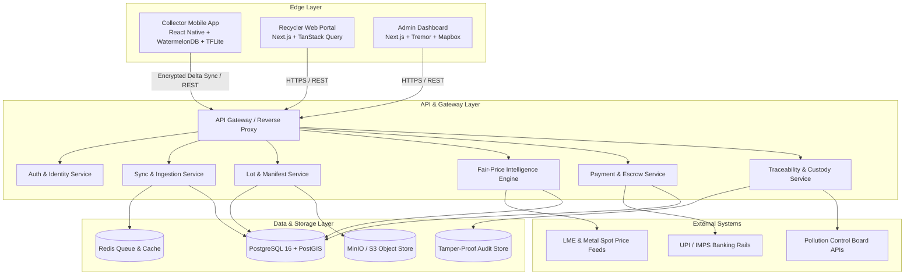
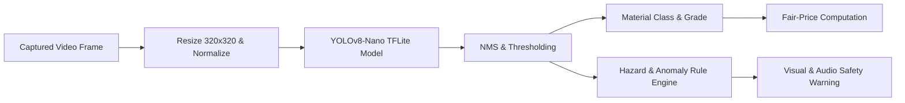

# ECOBRIDGE — System Architecture Document

This document provides a comprehensive technical reference for the ECOBRIDGE platform architecture.

---

## 1. System Topology & Component Interactions



---

## 2. Core Architectural Domains

### Domain 1: Collector Mobile Client (`apps/collector-mobile`)
- **Execution Target:** Android (API 24+) and iOS.
- **Local Persistence:** WatermelonDB backed by native SQLite. All mutations (item scanning, weight log, photo capture) are committed locally first with generated UUID v4 keys.
- **Computer Vision Pipeline:** Runs an on-device quantized INT8 YOLOv8-nano model via TensorFlow Lite. Evaluates frames in <250ms on edge devices, extracting item bounding boxes, material grades, and hazard indicators.
- **UX & Accessibility:**
  - Designed for users with varying literacy levels.
  - Color-coded safety visual tags: Green (Safe), Amber (Caution), Red (Severe Hazard — e.g. swelling battery, broken CRT).
  - Speech synthesis via localized audio dictionaries for verbal confirmation.

---

### Domain 2: Backend Services (`apps/api-server`)
- **Runtime:** Node.js (TypeScript) with Fastify / NestJS.
- **Service Modularization:**
  - **Identity & RBAC:** Manages sessions, OTP issuance, JWT validation, and multi-tenant access control.
  - **Lot & Inventory Manager:** Coordinates batch lifecycle states (`DRAFT` -> `SYNCED` -> `IN_TRANSIT` -> `RECEIVED` -> `GRADED` -> `SETTLED`).
  - **Price Intelligence Service:** Evaluates domestic and global metal spot indices, applying refining yield models and regional supply multipliers.
  - **Dispatch & Matching:** PostGIS spatial queries matching lots to nearby recycling centers based on capacity and material acceptance.

---

### Domain 3: Database & Data Modeling (`packages/database`)
- **Primary Relational Store:** PostgreSQL 16.
- **Spatial Features:** PostGIS for geolocation indexing (`geometry(Point, 4326)`) and routing calculations.
- **Time-Series Capabilities:** Partitioned tables or TimescaleDB hyper-tables for continuous scrap commodity pricing feeds.
- **Core Entities:**
  - `User`, `CollectorProfile`, `RecyclerFacility`
  - `WasteCategory`, `WasteItem`, `HazardClassification`
  - `Lot`, `LotItem`, `LotImage`
  - `CustodyEvent`, `EPRCertificate`
  - `Transaction`, `EscrowHold`, `PayoutRecord`

---

### Domain 4: Recycler Web Portal (`apps/recycler-portal`)
- **Purpose:** Operations interface at dismantling plants, shredding centers, and recycling facilities.
- **Gate Inwarding:** Scans collector QR codes from the mobile app; displays expected items, weights, and estimated values.
- **Weighbridge Integration:** Captures scale inputs, compares against collector-reported weights, and flags variances exceeding the configurable threshold (default: 5%).
- **Grading & Settlement:** Recycler confirms or updates item grades (Grade A/B/C) with photo documentation; triggers instant payout upon mutual approval.

---

### Domain 5: Admin Dashboard & Regulatory Console (`apps/admin-dashboard`)
- **Purpose:** Platform governance, auditor monitoring, and compliance oversight.
- **Features:**
  - Environmental license tracking (SPCB/CPCB authorization expiry dates).
  - Real-time heatmaps of e-waste collection intensity and transport vectors.
  - Statutory report export: Auto-generates official e-waste manifests (Form 2 / Form 3).
  - Anomaly monitoring: Detects suspicious spikes in reported scrap weights or abnormal payout volumes.

---

### Domain 6: Offline Synchronization Engine (`packages/sync-engine`)
- **Delta Sync Protocol:**
  - Incremental sync mechanism tracking `last_synced_at` timestamps and monotonic change vectors.
  - Client batches local un-synced records into a structured JSON payload:
    ```typescript
    interface SyncPayload {
      clientTimestamp: string;
      deviceId: string;
      mutations: {
        table: 'lots' | 'lot_items';
        action: 'INSERT' | 'UPDATE' | 'DELETE';
        id: string;
        data: Record<string, unknown>;
        version: number;
      }[];
    }
    ```
- **Conflict Resolution Matrix:**
  | Field Type | Strategy | Rationale |
  | :--- | :--- | :--- |
  | **Physical Collection Facts** (items, photos, initial weight) | Client-Wins | Recorded on the ground; collector's initial state is primary |
  | **Lot Status & Approval** | Server-Wins | Only facility operator or backend state machine can update status |
  | **Price Estimates** | Server-Wins | Pricing must reflect certified market scrap rates at lock-in time |
  | **Payment & Payout Status** | Server-Wins | Financial transactions are strictly server-authoritative |

---

### Domain 7: AI/ML Subsystems (`packages/ai-core`)



- **Material Detection Classes:**
  - Printed Circuit Boards (Telecom, PC, Consumer Electronics)
  - Lithium-ion Batteries (Pouch, 18650, Cylindrical)
  - Lead-acid Batteries & Inverters
  - Cathode Ray Tubes (CRT Displays) & Monitor Glass
  - Copper Coils, Deflection Yokes, Transformers
  - Electric Motors & Compressors
- **Fair-Price Formula:**
  $$\text{Fair Value} = \text{Weight} \times \left( \sum (\text{Metal Fraction} \times \text{Spot Price} \times \text{Recovery Yield}) - \text{Processing Cost} \right) \times \text{Regional Multiplier}$$
- **Net-Earning Optimization:**
  $$\text{Net Yield} = \text{Offered Revenue} - (\text{Distance (km)} \times \text{Transport Cost/km}) - \text{Dispute Risk Penalty}$$

---

### Domain 8: Payment & Escrow Settlement
- **Escrow Mechanics:**
  - Recyclers maintain a secured float/balance.
  - Upon QR check-in and weighbridge confirmation, funds for the lot are locked.
  - Mutual agreement on grading triggers instant payment release to the collector's preferred rail (UPI, IMPS, direct account transfer).
- **Audit Trails:** Immutable double-entry ledger records for every credit and debit, preventing balance drift and enabling financial auditing.

---

### Domain 9: Cryptographic Traceability (`packages/crypto-traceability`)
- **Tamper-Evident Chain:**
  $$\text{Block Hash} = \text{SHA-256}(\text{Previous Hash} + \text{Timestamp} + \text{GeoLocation} + \text{Actor ID} + \text{Lot Data Hash})$$
- **Digital Manifests:**
  - Each lot is assigned an encrypted QR code encapsulating its origin hash and batch UUID.
  - Physical stickers/tags printed at collection points link physical scrap bags to digital records.
  - Generates verifiable EPR destruction and recycling certificates with digital cryptographic seals.

---

### Domain 10: Testing & Verification Strategy
- **Unit & Integration Tests:** Vitest / Jest across packages and apps.
- **Offline & Network Chaos Simulation:** Custom network throttler injecting 2G latency, intermittent connection drops, and partial payload losses during sync runs.
- **E2E Automation:** Playwright suites for portal intake and gate operations.

---

### Domain 11: Deployment & Infrastructure
- **Containerization:** Multi-stage Docker builds targeting minimal distroless Node.js runtime images.
- **Local Dev Stack:** Docker Compose running PostgreSQL 16 with PostGIS, Redis 7, and MinIO (S3-compatible object storage).
- **Production Target:** Cloud container platforms (AWS ECS / EKS or Google Cloud Run / GKE) with managed database services.
